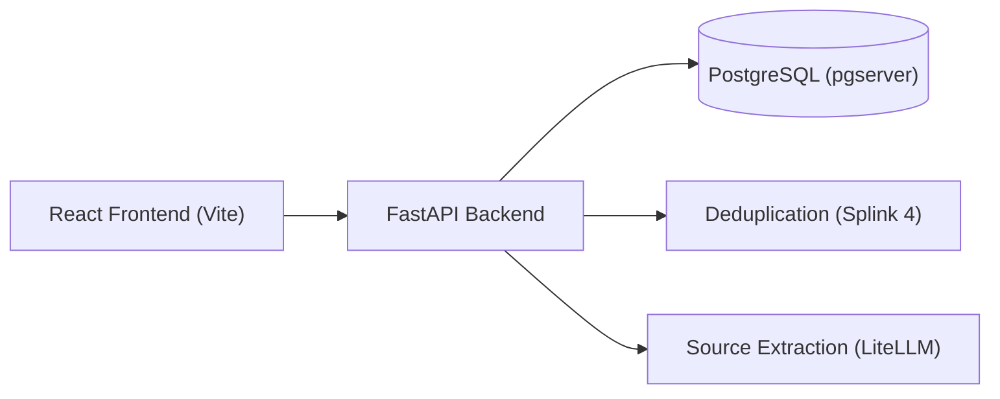

# Take-Home Assignment: AI-Assisted Mini Lead Management System

**Role:** AI Builder (Mid-Level)
**Time budget:** ~6–8 focused hours, spread over up to 1 week
**Format:** Take-home, submitted as a code repo (zip or GitHub link)

## Context

Our company is evaluating replacing HubSpot with an internal system for tracking marketing/sales leads.
This assignment is a **scoped-down slice** of that real project. You won't build the whole thing — just
enough to show us how you design data models, build a small API, and apply AI/LLM techniques to a
practical, messy, real-world problem (not a toy problem with clean inputs).

We've provided a synthetic (fake) dataset so you don't need any real integrations or credentials to start.
It's deliberately shaped like a raw CRM export rather than a clean sample table — see "About the dataset"
below before you start modeling it.

## Getting started

1. Unzip this package. You should have `README.md` (this file) and a `data/` folder containing
   `leads_seed.csv` and `website_form_submissions.json`.
2. Read "About the dataset" below, then skim `data/leads_seed.csv` yourself before writing any code —
   the columns and messiness are part of the problem, not an appendix.
3. Read through all of "What you're building" once before starting, so you can budget your ~6–8 hours
   across the 3 core pieces sensibly rather than over-investing in the first one.
4. Build, using whatever language/framework you're fastest in — there's no required stack (Python and
   Node are both fine, and so is anything else).
5. Write the README described under "Submission" as you go, not as an afterthought at hour 8.
6. Submit within 7 days — see "Submission" for exactly what to send and how.

If anything here is ambiguous, that's expected in places (see "About the dataset") — make a reasonable
call, document it, and move on. If you're genuinely stuck on what's in scope, email us; asking a good
scoping question is a positive signal, not a negative one.

## About the dataset

`data/leads_seed.csv` has just over **2,000 rows** and 22 columns, mirroring what a real HubSpot contacts
export looks like: most columns are irrelevant or entirely blank for every row (`Annual Revenue`, `GDPR
consent`, `Marketing contact status`, etc.), some are only populated for a handful of rows (`Job Title`,
`City`, `Lead Score`), and a number of rows use `Full Name` instead of `First Name`/`Last Name` (or vice
versa). Dates show up in mixed formats (`2026-06-02`, `6/4/2026`, `2026-05-20T00:00:00Z`), and `Lead
Status` casing/whitespace is inconsistent (`New`, `new`, `NEW`, `" New"`). The `Original Source` field is
sometimes blank or genuinely unhelpful (e.g. `"Offline Sources"` for an event lead) — the real story is
usually only in the free-text `Notes` column. None of this is a data bug to report back to us; it's the
starting condition. Deciding what to normalize, what to ignore, and how much cleaning effort is worth it
before you start on the AI tasks is part of what we're evaluating.

A meaningful fraction of the ~2,000 rows are duplicate or near-duplicate entries of someone already in the
file (re-entered with typos, a different name format, or reformatted contact details), and a smaller number
are genuinely different people who happen to share a company and a similar-sounding name — we're not
telling you the exact counts, since figuring that out is the point. At this size, an approach that eyeballs
the file or runs a full pairwise comparison across every record (~2,000² comparisons) won't be practical —
part of what we're evaluating is whether you reach for something that scales (blocking/candidate
generation before scoring, vectorized similarity, embeddings + nearest-neighbor search, etc.) rather than
brute-forcing it.

## What you're building

A small backend service (language/framework of your choice — Python and Node are both fine) that manages
a "leads" dataset and includes **two AI-assisted features**. A minimal frontend or CLI is fine; you do not
need a polished UI.

### 1. Lead store + API (core, ~2 hrs)

Load `data/leads_seed.csv` into storage (SQLite, Postgres, or even an in-memory store — your call, just
justify it in your README). Expose an API (REST is fine) with:

- `GET /leads` — list leads, with filtering by `status`, `owner` (Contact Owner), `country`, and a
  free-text `q` search across name/company/email
- `GET /leads/:id` — single lead detail
- `PATCH /leads/:id` — update status, owner, or notes
- `GET /leads/export` — CSV export of the current filtered view
- `POST /leads/ingest` — accepts a payload shaped like `data/website_form_submissions.json` entries and
  creates a new lead **or** updates an existing one if it's the same person (see dedup below)

### 2. AI-assisted lead deduplication (core, ~2–3 hrs)

The seed data has intentional duplicate/near-duplicate leads — same person entered more than once with
typos, formatting differences, or partial info (e.g. an email localpart that differs between entries, or a
company name with a different legal-suffix punctuation). Exact-match dedup on email won't catch all of
them, and running an LLM call over every possible pair isn't feasible at ~2,000 rows — you'll need to
narrow the candidate set first (e.g. block on normalized phone digits, email domain, or a cheap similarity
pre-filter) before applying a more expensive comparison to the surviving pairs.

Build a `POST /leads/dedupe-candidates` endpoint (or an offline script — your call) that returns groups of
likely-duplicate leads, ranked by confidence, using whatever approach you think is appropriate: embeddings

- similarity, an LLM prompt-based comparison, fuzzy string matching, or a hybrid. Briefly justify your
  approach in the README — we care more about your reasoning than which specific technique you pick, and
  about how you kept it tractable at this scale.

You do **not** need to auto-merge leads. Surfacing candidate pairs with a confidence score/explanation is
enough.

### 3. AI-assisted source extraction (core, ~1–2 hrs)

Real lead source data is messy — see the `Notes` column in the seed data (e.g. `"Met him at the SFF booth,
scanned our QR code"` or `"Found us through organic google search then booked a demo"`), and don't assume
the `Original Source` column is trustworthy (it's often blank or too generic to be useful — see "About the
dataset" above). Write a function/endpoint that takes the raw text and extracts a structured result:

```json
{
  "channel": "Event",
  "detail": "Singapore FinTech Festival 2026 — Booth QR Code"
}
```

Channel should map to one of: `Website`, `Event`, `LinkedIn`, `Organic Search`, `Referral`, `Manual/Sales`,
`Other`. You can use an LLM call, a rules/regex pass, or a hybrid — again, justify the choice.

### 4. Basic dashboard endpoint (bonus, ~30–60 min)

`GET /dashboard` returning lead counts by status and by source channel. JSON is enough; a rendered chart is
a nice-to-have, not required.

## Explicitly out of scope (do not build these)

To keep this to one week, please **skip**: authentication/user roles, website analytics/GA integration,
webhook infra beyond the single ingest endpoint, full audit-log/activity-history UI, HubSpot data migration
tooling, and any production concerns (deployment, scaling, monitoring). If you have time left over, a short
"what I'd do next" note in the README is worth more than partial extra features.

## What we're evaluating

- How you model messy, real-world data and make reasonable tradeoffs under time pressure
- How you apply AI/LLM techniques to a genuinely ambiguous problem (dedup, extraction) rather than a
  leetcode-style prompt
- Code clarity and basic test coverage (a handful of meaningful tests, not 100% coverage)
- Judgment about scope — what you cut and why, documented in your README

## Submission

1. Make sure your `README.md` covers: how to run it, your design decisions (especially for dedup and
   source extraction), and what you'd do next with more time.
2. Include whatever tests you wrote — no minimum count, just enough to show you tested the ambiguous
   cases, not only the happy path.
3. If you used a paid LLM API, note which provider/model in your README and roughly what it cost you in
   credits. If you'd rather not spend personal money on API credits, a free-tier key, a local/open-source
   model, or a mocked LLM call are all completely fine — just say in your README which you used and why.
   We're evaluating your approach, not your spend.
4. Send us a GitHub repo link (make sure we have access) or a zip file, within **7 days** of receiving
   this assignment.

Questions welcome any time before you submit — email us. Asking a good scoping question is a positive
signal, not a negative one.

<br>

# AI-Assisted Mini Lead Management System Project

<a target="_blank" href="https://cookiecutter-data-science.drivendata.org/">
    
</a>

</br>

An internal lead management platform for sales and marketing teams evaluating a lightweight, self-hosted alternative to HubSpot. It unifies inbound lead tracking while solving real-world CRM data quality issues: detecting duplicate contacts using scalable probabilistic record linkage and extracting structured acquisition channels from free-text notes.



## Data pipeline Workflow

This data marks the raw data exploration using jupyter notebooks so we have a picture on how to handle the data in the later stages.

The data preparation uses the notebook `notebooks/1.0-data-cleaning.ipynb`. The original file (`data/raw/leads_seed.csv`) remains strictly immutable, generating a standardized dataset at `data/interim/leads_cleaned.csv`. Here are the summaries of the steps from the notebook.

### Step 1: Structure Normalization

- **Column Standardization:** Mapped HubSpot-style title headers into clean, lowercase `snake_case` identifiers (`record_id`, `first_name`, `last_name`, `full_name`, `email`, `phone_number`, `lead_status`, `notes`, etc.).
- **Dead Column Removal:** Identified and pruned unused HubSpot CRM export columns having >95% missing values (`City`, `Original Source Drill-Down 1`, `Annual Revenue`, `Marketing contact status`, `GDPR consent`, `Lead Score`).

### Step 2: Validity Checks

- **Lead Status Normalization:** Cleaned whitespace and casing inconsistencies (`New`, `new`, `NEW`, `" New"`) into standardized title-case values (`New`, `Contacted`, `Connected`, `Qualified`, `Opportunity`, `Closed Won`, `Closed Lost`).
- **Email Verification:** Validated all 2,049 emails using regex format matching after lowercase conversion and whitespace trimming (100% valid format rate).
- **Phone Digit Normalization:** Extracted normalized numerical sequences (`phone_digits`) for indexing and downstream candidate blocking.
- **Timestamp Normalization:** Parsed mixed date formats (`2026-06-02`, `6/4/2026`, `2026-05-20T00:00:00Z`) into UTC timestamps;

### Step 3: Duplicate Screening

We do not drop anything here, we preserved all records for the AI deduplication scoring stage. We just want to explore the original data and see what we are dealing with using exact matching.

- **Exact Duplicates & ID Collisions:** Verified 0 full-row exact duplicates and 0 duplicate `record_id` values.
- **Near-Duplicate Surfacing:** Blocked on normalized phone digits and lowercased email addresses:
  - 58 email addresses appear more than once.
  - 232 phone digit fingerprints appear across multiple records with slight variations in name spelling or company legal suffix.

### Step 4: Missing Data & Name Resolution

- **Lossless Name Resolution:**
  - If `first_name` and `last_name` exist, synthesized `full_name`.
  - If only `full_name` is present, parsed into `first_name` and `last_name`.
- **Categorical Imputation:** Defaulted empty optional fields (`contact_owner` to `Unassigned`, `country` to `Unknown`, empty strings for optional text fields).

### Step 5: Outliers and Anomalies Detection

We also want to check for extreme or broken data just to be safe.

- **Phone Digit Lengths:** Audited digit distributions (standard lengths 10 to 13 digits); verified 0 truncated phone strings (<7 digits).
- **Temporal Bounds:** Confirmed all creation dates sit within expected range (September 2025 to June 2026) with 0 future-dated records.
- **Notes Lengths:** Inspected character lengths across the free-text `notes` field (mean ~74 chars, min 33, max 160) ensuring all records contain parseable source context.

## Dedup Workflow

The deduplication endpoint (`POST /leads/dedupe-candidates`) implements **Fellegi-Sunter probabilistic record linkage using [Splink 4](https://moj-analytical-services.github.io/splink/index.html)**, a state of the art record linkage solution and adopted industry-wide. It identifies duplicate or near-duplicate leads across PostgreSQL records without running expensive brute-force pairwise comparisons. We use this method because:

1. **Proven Better than fuzzy/exact matching:** Exact matching can miss duplicates when records contain typos, formatting differences, or missing values. Probabilistic linkage is designed to handle these imperfect identifiers.

2. **Multiple and unique rules for each column:** Instead of treating every field agreement equally, Fellegi-Sunter combines agreement and disagreement evidence across multiple fields to determine whether two records are likely to represent the same entity.

3. **Data-driven weights:** Fellegi-Sunter assigns weights based on how strongly each field agreement or disagreement distinguishes matches from non-matches, reducing the need for manually defining and tuning many matching rules.

4. **No expensive process or LLM calls:** The matching process runs using the host hardware using deterministic string comparisons and probabilistic scoring, avoiding per-record LLM/API calls, external dependencies, and their associated latency and cost, performance depends on specs but it is not that resource expensive compared to the later one.

### Step 1: Candidate Blocking

At ~2,000 records, unconstrained pairwise comparisons require $(N \times (N-1)) / 2 \approx 2.1 \text{ million}$ evaluations, making full-table fuzzy matching or LLM comparisons intractable. The endpoint constrains candidate pair generation using two blocking rules: `phone_digits_str` (grouping leads that share normalized phone digits) and `email_domain` (grouping leads that share corporate email domains). Only candidate pairs satisfying at least one of these blocking rules advance to probabilistic scoring.

### Step 2: Probabilistic Comparisons and Parameter Training

Candidate pairs are evaluated across four feature comparisons: exact match on normalized phone digits, Levenshtein distance on full name (threshold of 2), Jaro-Winkler string similarity on company name (threshold of 0.88), and Levenshtein distance on email address (threshold of 3).

Model parameters are estimated directly from data without requiring manual labels. Unlinked agreement rates (u-probabilities) are estimated via random pair sampling across 10,000 pairs to determine baseline chance agreement. Linked agreement rates (m-probabilities) are estimated using Expectation-Maximization (EM) on the phone blocking rule, learning how reliably true duplicate records agree across attributes.

### Step 3: Graph Clustering and Candidate Grouping

Rather than surfacing fragmented pairwise links (left and right comparisons), the model applies Splink 4 connected components graph clustering (`linker.clustering.cluster_pairwise_predictions_at_threshold`) at the specified match probability `threshold` (default 0.50). This groups all directly and transitively linked records into unified entity clusters. The endpoint filters out singletons (unique leads with no duplicates) and returns duplicate candidate clusters containing two or more records, ranked by confidence and cluster size up to the requested `limit` (default 100).

Example response payload:

```json
[
  {
    "cluster_id": 100234955,
    "lead_count": 3,
    "confidence": 0.939,
    "leads": [
      {
        "record_id": 100234955,
        "full_name": "Ji-woo Yoon",
        "company_name": "Foster Studio",
        "email": "ji-wooy@foster.biz",
        "phone_digits": "34696235827"
      },
      {
        "record_id": 100234956,
        "full_name": "J. Yoon",
        "company_name": "Foster Trading",
        "email": "j.yoon@foster.biz",
        "phone_digits": "34696235827"
      },
      {
        "record_id": 100234957,
        "full_name": "J. Yoon",
        "company_name": "Foster Partners",
        "email": "ji-woo.yoon@foster.biz",
        "phone_digits": "34696235827"
      }
    ]
  }
]
```

## AI-Assisted Source Extraction Workflow

The source extraction endpoint (`POST /leads/source-extract`) extracts structured acquisition channels and context details from raw, unstructured lead notes text.

### Why Structured LLM Extraction Layer

Unstructured lead notes are too inconsistent for brittle keyword or regex matching, while unconstrained LLM calls risk malformed JSON and hallucinated categories. Static matching also cannot capture context.

To solve this, we combine some powerful libraries such as **LiteLLM**, **Instructor**, and **Pydantic** into a structured, provider-agnostic extraction layer. LiteLLM provides seamless model interchangeability across providers (OpenAI, Anthropic, Gemini, or local models), Instructor guarantees schema enforcement during execution, and Pydantic restricts the output strictly to the seven allowed channel categories with concise source evidence.

### Configuration and Bringing Your Own API Key

The extraction service reads its provider and authentication details from environment variables (`.env`):

```bash
# Model identifier (supports any LiteLLM format, e.g. gpt-4o-mini, claude-3-5-sonnet, gemini/gemini-1.5-flash)
LLM_MODEL=gpt-4o-mini

# API key for the chosen provider
LLM_API_KEY=your_api_key_here

# Optional: custom base URL for local LLMs or proxy endpoints
# LLM_API_BASE=http://localhost:11434
```

Users can bring their own API key for OpenAI (`OPENAI_API_KEY`), Anthropic (`ANTHROPIC_API_KEY`), or Google Gemini (`GEMINI_API_KEY`), or pass `LLM_API_KEY`.

> Note: I use a free tier gemini API key here, so no credit was taken.

Example request and response payload:

```http
POST /leads/source-extract
Content-Type: application/json

{
  "text": "Met him at the SFF booth, scanned our QR code"
}
```

```json
{
  "channel": "Event",
  "detail": "Singapore FinTech Festival 2026 - Booth QR Code"
}
```

## Setup and How to run

Python and Node is required globally on your machine to run this project.

Create and activate virtual environment:

```bash
python -m venv .venv
source .venv/bin/activate  # Windows: .venv\Scripts\activate
```

Install dependencies:

```bash
pip install -r requirements.txt
```

Initialize PostgreSQL database and apply migrations:

```bash
python ai_assisted_mini_lead_management_system/db/regenerate.py
```

Start the FastAPI backend server:

```bash
uvicorn api.main:app --reload
```

Start the React frontend:

```bash
npm run dev
```

> Note: DB starts automatically. PostgreSQL runs as an embedded instance managed by `pgserver` in the local `pgdata/` directory, and DuckDB for splink dedup runs in-process inside the application.

## Endpoints

| Method  | Endpoint                   | Description                                 | Parameters / Payload                                 | Response                                                         |
| :------ | :------------------------- | :------------------------------------------ | :--------------------------------------------------- | :--------------------------------------------------------------- |
| `GET`   | `/leads`                   | List and search leads with pagination       | `status`, `owner`, `country`, `q`, `limit`, `offset` | Array of lead objects with total count in `X-Total-Count` header |
| `GET`   | `/leads/{id}`              | Fetch single lead by primary key ID         | `id` (path)                                          | Lead record object or 404 error if not found                     |
| `PATCH` | `/leads/{id}`              | Update status, owner, or notes              | `id` (path), JSON body with mutable fields           | Updated lead record object                                       |
| `GET`   | `/leads/export`            | Download filtered leads as CSV              | `status`, `owner`, `country`, `q`                    | Downloadable CSV file attachment (`leads_export.csv`)            |
| `POST`  | `/leads/ingest`            | Website form submission ingest              | Single or batch JSON form submission payload         | Ingestion status (`created` or `updated`) and lead record        |
| `POST`  | `/leads/dedupe-candidates` | Run Fellegi-Sunter duplicate clustering     | `threshold` (query, default 0.5), `limit` (query)    | Ranked clusters of likely duplicate lead records                 |
| `POST`  | `/leads/source-extract`    | Structured AI acquisition source extraction | JSON body with raw `text` notes                      | Extracted acquisition channel and source detail                  |
| `GET`   | `/dashboard`               | Aggregate lead counts                       | None                                                 | Lead counts grouped by status and acquisition channel            |

## Test Suites

## Future works

1. **Lead Merge Workflow:** Implement a `POST /leads/merge` endpoint with field survivorship rules (primary record selection, notes concatenation, contact owner assignment), soft-deletes, and an audit trail to consolidate duplicate clusters into canonical records.
2. **Async Workers for Dedup & Extraction:** Offload potential heavy Splink clustering jobs and LLM extraction calls to asynchronous background workers (such as Celery or Redis Queue) with task polling and caching to avoid HTTP request timeouts during bulk operations.
3. **Dockerization:** Split the architecture into separate production-ready containers via Docker Compose.
4. **LLM Guardrails & Rate Limiting:** Add token rate limiting, cost quotas, prompt injection defenses, and automatic fallback models to prevent API abuse and cost overruns.
