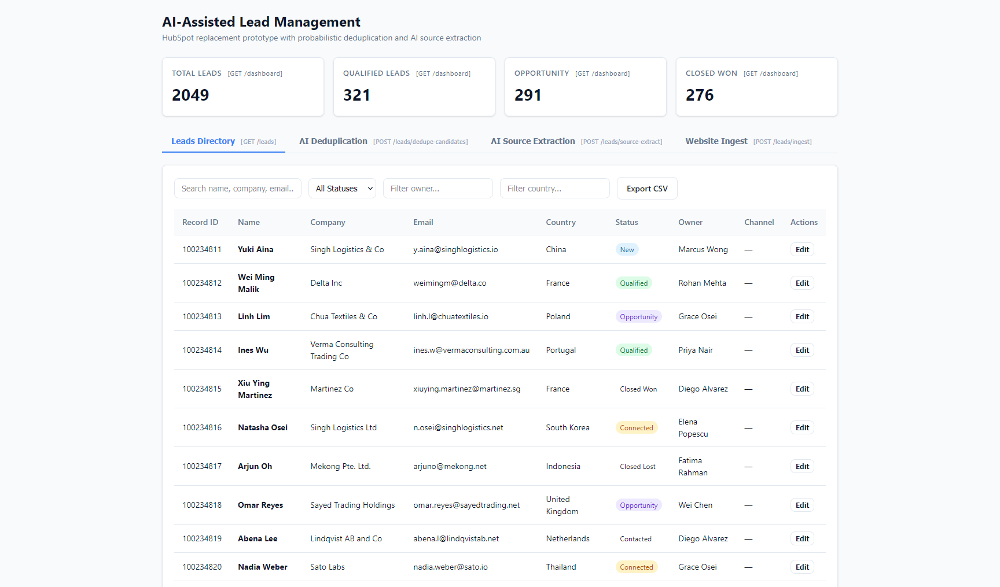
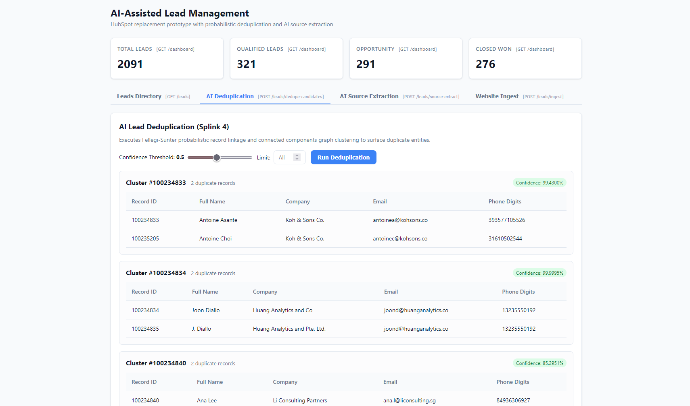
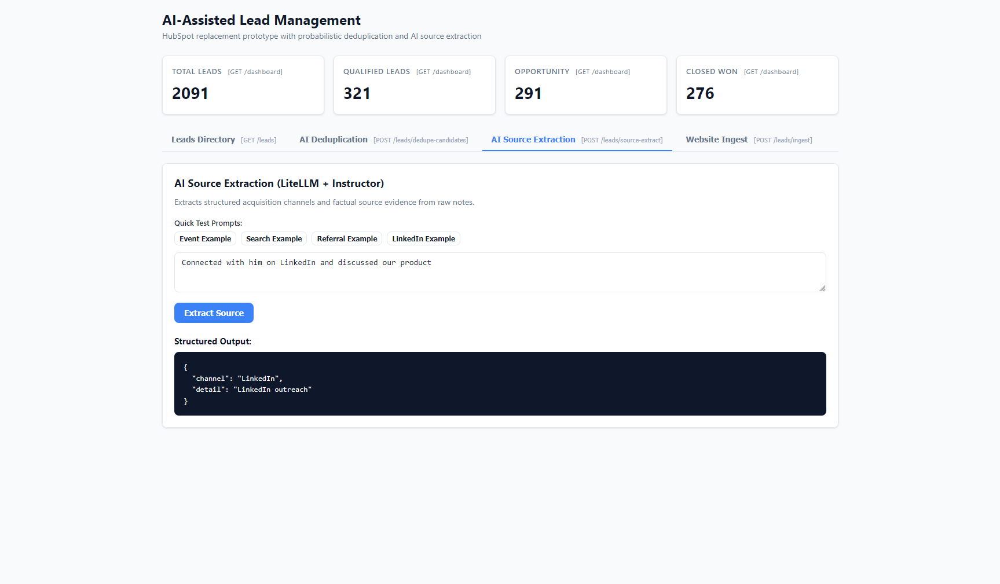
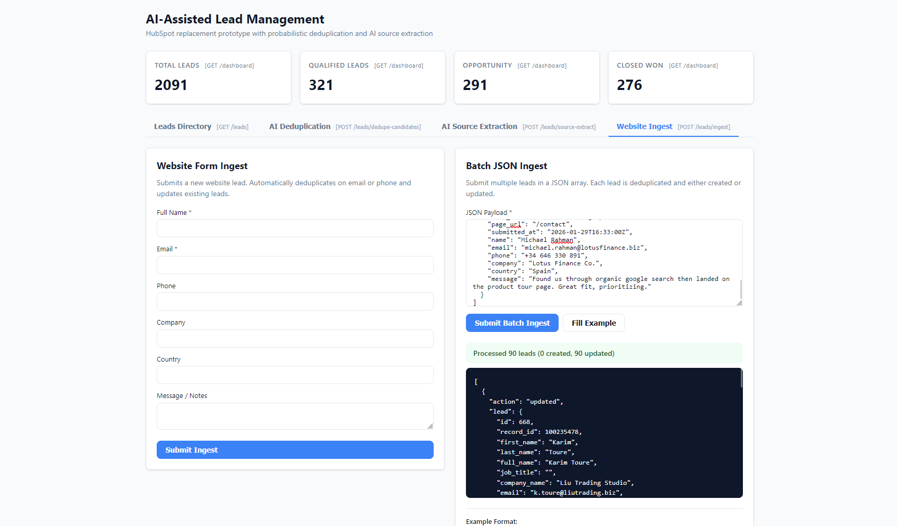
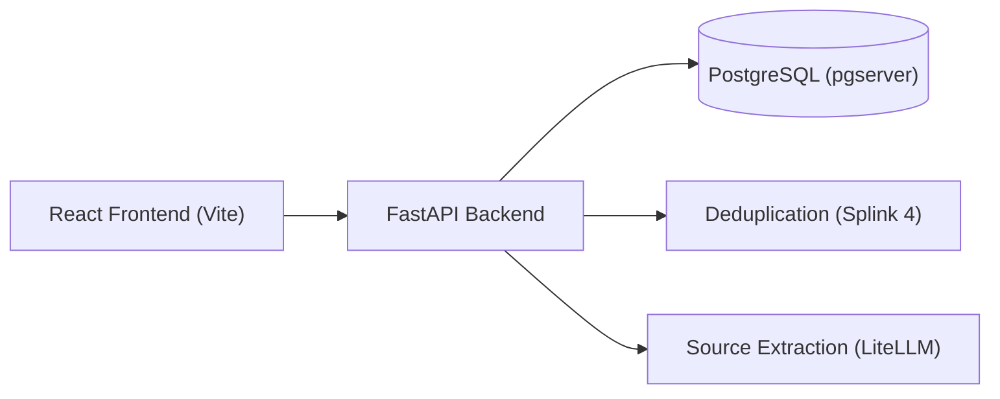

# Mikomi - AI-Assisted Lead Management System

<a target="_blank" href="https://cookiecutter-data-science.drivendata.org/">
    
</a>

</br>

An internal lead management platform for sales and marketing teams evaluating a lightweight, self-hosted alternative to HubSpot. It unifies inbound lead tracking while solving real-world CRM data quality issues: detecting duplicate contacts using scalable probabilistic record linkage and extracting structured acquisition channels from free-text notes.

### Project Overview

|              Leads Dashboard & Filters               |               AI Lead Deduplication                |
| :--------------------------------------------------: | :------------------------------------------------: |
|     |      |
|               **AI Source Extraction**               |              **Website Form Ingest**               |
|  |  |



## Data pipeline Workflow

The data preparation uses the notebook `notebooks/1.0-data-cleaning.ipynb`. The original file (`data/raw/leads_seed.csv`) remains strictly immutable, generating a standardized dataset at `data/interim/leads_cleaned.csv`. Here are the summaries of the steps from the notebook.

### Step 1: Structure Normalization

- **Column Standardization:** Mapped HubSpot-style title headers into clean, lowercase `snake_case` identifiers (`record_id`, `first_name`, `last_name`, `full_name`, `email`, `phone_number`, `lead_status`, `notes`, etc.).
- **Dead Column Removal:** Identified and pruned unused HubSpot CRM export columns having >95% missing values (`City`, `Original Source Drill-Down 1`, `Annual Revenue`, `Marketing contact status`, `GDPR consent`, `Lead Score`).

### Step 2: Validity Checks

- **Lead Status Normalization:** Cleaned whitespace and casing inconsistencies (`New`, `new`, `NEW`, `" New"`) into standardized title-case values (`New`, `Contacted`, `Connected`, `Qualified`, `Opportunity`, `Closed Won`, `Closed Lost`).
- **Email Verification:** Validated all 2,049 emails using regex format matching after lowercase conversion and whitespace trimming (100% valid format rate).
- **Phone Digit Normalization:** Extracted normalized numerical sequences (`phone_digits`) for indexing and downstream candidate blocking.
- **Timestamp Normalization:** Parsed mixed date formats (`2026-06-02`, `6/4/2026`, `2026-05-20T00:00:00Z`) into UTC timestamps;

### Step 3: Duplicate Screening

We do not drop anything here, we preserved all records for the AI deduplication scoring stage. We just want to explore the original data and see what we are dealing with using exact matching.

- **Exact Duplicates & ID Collisions:** Verified 0 full-row exact duplicates and 0 duplicate `record_id` values.
- **Near-Duplicate Surfacing:** Blocked on normalized phone digits and lowercased email addresses:
  - 58 email addresses appear more than once.
  - 232 phone digit fingerprints appear across multiple records with slight variations in name spelling or company legal suffix.

### Step 4: Missing Data & Name Resolution

- **Lossless Name Resolution:**
  - If `first_name` and `last_name` exist, synthesized `full_name`.
  - If only `full_name` is present, parsed into `first_name` and `last_name`.
- **Categorical Imputation:** Defaulted empty optional fields (`contact_owner` to `Unassigned`, `country` to `Unknown`, empty strings for optional text fields).

### Step 5: Outliers and Anomalies Detection

We also want to check for extreme or broken data just to be safe.

- **Phone Digit Lengths:** Audited digit distributions (standard lengths 10 to 13 digits); verified 0 truncated phone strings (<7 digits).
- **Temporal Bounds:** Confirmed all creation dates sit within expected range (September 2025 to June 2026) with 0 future-dated records.
- **Notes Lengths:** Inspected character lengths across the free-text `notes` field (mean ~74 chars, min 33, max 160) ensuring all records contain parseable source context.

## Dedup Workflow

The deduplication endpoint (`POST /leads/dedupe-candidates`) implements **Fellegi-Sunter probabilistic record linkage using [Splink 4](https://moj-analytical-services.github.io/splink/index.html)**, a state of the art record linkage solution and adopted industry-wide. It identifies duplicate or near-duplicate leads across PostgreSQL records without running expensive brute-force pairwise comparisons. We use this method because:

1. **Proven Better than fuzzy/exact matching:** Exact matching can miss duplicates when records contain typos, formatting differences, or missing values. Probabilistic linkage is designed to handle these imperfect identifiers.

2. **Multiple and unique rules for each column:** Instead of treating every field agreement equally, Fellegi-Sunter combines agreement and disagreement evidence across multiple fields to determine whether two records are likely to represent the same entity.

3. **Data-driven weights:** Fellegi-Sunter assigns weights based on how strongly each field agreement or disagreement distinguishes matches from non-matches, reducing the need for manually defining and tuning many matching rules.

4. **No expensive process or LLM calls:** The matching process runs using the host hardware using deterministic string comparisons and probabilistic scoring, avoiding per-record LLM/API calls, external dependencies, and their associated latency and cost, performance depends on specs but it is not that resource expensive compared to the later one.

### Step 1: Candidate Blocking

At ~2,000 records, unconstrained pairwise comparisons require $(N \times (N-1)) / 2 \approx 2.1 \text{ million}$ evaluations, making full-table fuzzy matching or LLM comparisons intractable. The endpoint constrains candidate pair generation using two blocking rules: `phone_digits_str` (grouping leads that share normalized phone digits) and `email_domain` (grouping leads that share corporate email domains). Only candidate pairs satisfying at least one of these blocking rules advance to probabilistic scoring.

### Step 2: Probabilistic Comparisons and Parameter Training

Candidate pairs are evaluated across four feature comparisons: exact match on normalized phone digits, Levenshtein distance on full name (threshold of 2), Jaro-Winkler string similarity on company name (threshold of 0.88), and Levenshtein distance on email address (threshold of 3).

Model parameters are estimated directly from data without requiring manual labels. Unlinked agreement rates (u-probabilities) are estimated via random pair sampling across 10,000 pairs to determine baseline chance agreement. Linked agreement rates (m-probabilities) are estimated using Expectation-Maximization (EM) on the phone blocking rule, learning how reliably true duplicate records agree across attributes.

### Step 3: Graph Clustering and Candidate Grouping

Rather than surfacing fragmented pairwise links (left and right comparisons), the model applies Splink 4 connected components graph clustering (`linker.clustering.cluster_pairwise_predictions_at_threshold`) at the specified match probability `threshold` (default 0.50). This groups all directly and transitively linked records into unified entity clusters. The endpoint filters out singletons (unique leads with no duplicates) and returns duplicate candidate clusters containing two or more records, ranked by confidence and cluster size up to the requested `limit` (default 100).

Example response payload:

```json
[
  {
    "cluster_id": 100234955,
    "lead_count": 3,
    "confidence": 0.939,
    "leads": [
      {
        "record_id": 100234955,
        "full_name": "Ji-woo Yoon",
        "company_name": "Foster Studio",
        "email": "ji-wooy@foster.biz",
        "phone_digits": "34696235827"
      },
      {
        "record_id": 100234956,
        "full_name": "J. Yoon",
        "company_name": "Foster Trading",
        "email": "j.yoon@foster.biz",
        "phone_digits": "34696235827"
      },
      {
        "record_id": 100234957,
        "full_name": "J. Yoon",
        "company_name": "Foster Partners",
        "email": "ji-woo.yoon@foster.biz",
        "phone_digits": "34696235827"
      }
    ]
  }
]
```

## AI-Assisted Source Extraction Workflow

The source extraction endpoint (`POST /leads/source-extract`) extracts structured acquisition channels and context details from raw, unstructured lead notes text.

### Why Structured LLM Extraction Layer

Unstructured lead notes are too inconsistent for brittle keyword or regex matching, while unconstrained LLM calls risk malformed JSON and hallucinated categories. Static matching also cannot capture context.

To solve this, we combine some powerful libraries such as **LiteLLM**, **Instructor**, and **Pydantic** into a structured, provider-agnostic extraction layer. LiteLLM provides seamless model interchangeability across providers (OpenAI, Anthropic, Gemini, or local models), Instructor guarantees schema enforcement during execution, and Pydantic restricts the output strictly to the seven allowed channel categories with concise source evidence.

### Configuration and Bringing Your Own API Key

The extraction service reads its provider and authentication details from environment variables (`.env`):

```bash
# Model identifier (supports any LiteLLM format, e.g. gpt-4o-mini, claude-3-5-sonnet, gemini/gemini-1.5-flash)
LLM_MODEL=gpt-4o-mini

# API key for the chosen provider
LLM_API_KEY=your_api_key_here

# Optional: custom base URL for local LLMs or proxy endpoints
# LLM_API_BASE=http://localhost:11434
```

Users can bring their own API key for OpenAI (`OPENAI_API_KEY`), Anthropic (`ANTHROPIC_API_KEY`), or Google Gemini (`GEMINI_API_KEY`), or pass `LLM_API_KEY`.

> Note: I use a free tier gemini API key here, so no credit was taken.

Example request and response payload:

```http
POST /leads/source-extract
Content-Type: application/json

{
  "text": "Met him at the SFF booth, scanned our QR code"
}
```

```json
{
  "channel": "Event",
  "detail": "Singapore FinTech Festival 2026 - Booth QR Code"
}
```

## Setup and How to run

Python and Node is required globally on your machine to run this project.

Create and activate virtual environment:

```bash
python -m venv .venv
source .venv/bin/activate  # Windows: .venv\Scripts\activate
```

Install dependencies:

```bash
pip install -r requirements.txt
```

Initialize PostgreSQL database and apply migrations:

```bash
python ai_assisted_mini_lead_management_system/db/regenerate.py
```

Start the FastAPI backend server:

```bash
uvicorn api.main:app --reload
```

Start the React frontend:

```bash
npm run dev
```

> Note: DB starts automatically. PostgreSQL runs as an embedded instance managed by `pgserver` in the local `pgdata/` directory, and DuckDB for splink dedup runs in-process inside the application.

## Endpoints

| Method  | Endpoint                   | Description                                 | Parameters / Payload                                 | Response                                                         |
| :------ | :------------------------- | :------------------------------------------ | :--------------------------------------------------- | :--------------------------------------------------------------- |
| `GET`   | `/leads`                   | List and search leads with pagination       | `status`, `owner`, `country`, `q`, `limit`, `offset` | Array of lead objects with total count in `X-Total-Count` header |
| `GET`   | `/leads/{id}`              | Fetch single lead by primary key ID         | `id` (path)                                          | Lead record object or 404 error if not found                     |
| `PATCH` | `/leads/{id}`              | Update status, owner, or notes              | `id` (path), JSON body with mutable fields           | Updated lead record object                                       |
| `GET`   | `/leads/export`            | Download filtered leads as CSV              | `status`, `owner`, `country`, `q`                    | Downloadable CSV file attachment (`leads_export.csv`)            |
| `POST`  | `/leads/ingest`            | Website form submission ingest              | Single or batch JSON form submission payload         | Ingestion status (`created` or `updated`) and lead record        |
| `POST`  | `/leads/dedupe-candidates` | Run Fellegi-Sunter duplicate clustering     | `threshold` (query, default 0.5), `limit` (query)    | Ranked clusters of likely duplicate lead records                 |
| `POST`  | `/leads/source-extract`    | Structured AI acquisition source extraction | JSON body with raw `text` notes                      | Extracted acquisition channel and source detail                  |
| `GET`   | `/dashboard`               | Aggregate lead counts                       | None                                                 | Lead counts grouped by status and acquisition channel            |

## Test Suites

The automated test suite evaluates core business logic, deduplication clustering, and ambiguous real-world edge cases using `pytest` and FastAPI's `TestClient`.

Run the test suite:

```bash
pytest -v
```

### Test Coverage Summary

| Test Area | Test File | Scenarios Tested |
| :--- | :--- | :--- |
| **Ingestion & Auto-Deduplication** | `tests/test_ingest.py` | 1. New lead creation with defaults.<br>2. Case-insensitive email duplicate matching and notes append.<br>3. Normalized phone digits fallback matching on different email aliases.<br>4. Mixed batch submissions (new and duplicate leads in a single payload). |
| **Probabilistic Deduplication** | `tests/test_dedup.py` | 1. Fellegi-Sunter candidate cluster schema verification.<br>2. Cluster limit parameter enforcement.<br>3. High-threshold filtering behavior (e.g. threshold >= 0.98).<br>4. Record isolation ensuring distinct identities within clusters. |
| **AI Source Extraction** | `tests/test_source_extract.py` | 1. Event booth note classification (`Event`).<br>2. Empty and whitespace note fallback (`Other`, `Empty notes`).<br>3. Peer referral note classification (`Referral`).<br>4. Strict Pydantic enum validation across the seven allowed marketing channels. |

## Future works

1. **Lead Merge Workflow:** Implement a `POST /leads/merge` endpoint with field survivorship rules (primary record selection, notes concatenation, contact owner assignment), soft-deletes, and an audit trail to consolidate duplicate clusters into canonical records.
2. **Async Workers for Dedup & Extraction:** Offload potential heavy Splink clustering jobs and LLM extraction calls to asynchronous background workers (such as Celery or Redis Queue) with task polling and caching to avoid HTTP request timeouts during bulk operations.
3. **Dockerization:** Split the architecture into separate production-ready containers via Docker Compose.
4. **LLM Guardrails & Rate Limiting:** Add token rate limiting, cost quotas, prompt injection defenses, and automatic fallback models to prevent API abuse and cost overruns.
